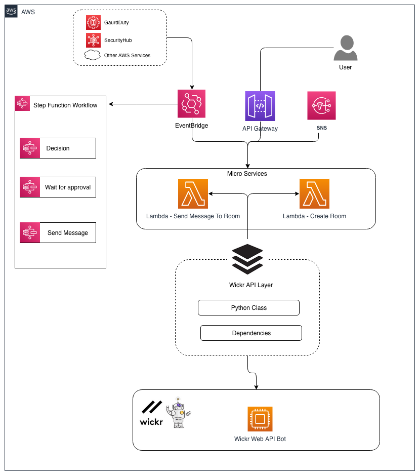

# Integration Framework for Wickr

The integration Framework for Wickr allows developers to create event driven archtiectures representing serverless "bots" that can be used to construct Wickr integrations such as chat bots, workflows and any other process using many AWS services.

The reference architecture presented here is designed to give you a head start based on example use cases which can be extended for your organisations requirements.

### What's it Written In?
The framwork is written using the [AWS Serverless Application Model](https://aws.amazon.com/serverless/sam/) allowing developers to use common IDEs and local debugging.

## Reference Architecture 



[^NOTE]: The above diagram depicts two Lambda functions, in reality a library will contain many other functions

## Use Cases and Integration Points

The possiblities for creating AWS and Wickr integrations are endless but here are some example use cases:

### AWS StepFunctions

In this use case a workflow could be created based on numerous decision points utilising customer data to drive the process.

### AWS API Gateway

The Wickr API can be exposed to other platforms internally and externally using the API Gateway.  Other features include enhanced authorisation using Cognito.

### AWS Event Bridge

Using an event based architecture opens up numerous AWS services

# Installation

The framework has been written with developers in mind and it uses the AWS SAM which allows local development/debugging of Lambda functions.

## Prerequisites

- Install the latest SAM framework (this repo was built with v1.46.0+) - [Install Guide](https://docs.aws.amazon.com/serverless-application-model/latest/developerguide/serverless-sam-cli-install.html)
- Install AWS CLI V2
- You have configured the Wickr Web Interface API bot and have a Wickr API key, token and URL. - [Wickr Rest API guide](https://wickrinc.github.io/wickrio-docs/#existing-integrations-web-interface-integration)

## Steps

````bash
make deploy/guided
````

### Guided Parameters

| Name                 | Value                              | Description                                                  |
| -------------------- | ---------------------------------- | ------------------------------------------------------------ |
| Stack Name           | AWIF                               | AWS CloudFormation stack name                                |
| AWS Region           | eu-west-1                          | Valid AWS region to deploy the stack                         |
| WickrUrl             | http://example.net/WickrIO/V1/Apps | Valid URL where the Wickr API is installed - no Wickr key    |
| WickrApiKey          | your-api-key                       | Wickr API key                                                |
| WickrApiToken        | your-wickr-token                   | Base64 encoded Wickr authentication token i.e. MTIzNDU2Nzg5MDEyMzQ1Njc4OTAxMjM0 |
| WickrVerifyCert      | True                               | True if the Wickr API endpoint certificate should be validated, False otherwise |
| WickrLocatorRoomName | TAK Locator                        | Room name used for the location tracker integration example  |
| WickrPIIRoomName     | PII Detector                       | Room name used for the PII detector example                  |
| WickrChatBotRoomName | Chat Bot                           | Room name used for the chat bot example                      |
| VPCId                | your-vpc-id                        | The AWS Lambda functions are configured to run within a VPC.  Enter your VPC ID where you would like the |


## Makefile Targets

The following targets are available: 


```

debug/incident                 Run the Lambda IR function
delete                         Delete application
dependencies                   Add Python dependencies
deploy/custom                  Deploy the SAM app with custom params
deploy/guided                  Guided deployment
deploy                         Deploy the SAM app (once deploy/guided has been runn to generate a samconfig.yaml)
package                        Create CF output
```

# Configuration 

## Wickr

In order to use the Wickr API callbacks you will need to register a target URL that the Wickr IO client will use to send incoming messages to.

1. Retrieve the AWS API Gateway endpoint from the AWS CloudFormation stack outputs named `AdapaterGatewayApi`

2. The following pseudocode (taken from [here](https://github.com/WickrInc/wickrio-example-app-python/blob/master/python-web-requester/requester.py)) shows an example of setting the Wickr IO client callback URL 

    ```python
    payload = {'callbackurl': 'https://abcde123ri.execute-api.eu-west-1.amazonaws.com/Prod/'}
    setMsgRecvCallback = requests.post(URL + /MsgRecvCallback",headers=PARAMS,params=payload)
    ```

    

For more information on Wickr URL Callbacks see the documentation here: https://wickrinc.github.io/wickrio-docs/#existing-integrations-web-interface-integration-web-interface-rest-api

## Parameter Requirements

**Wickr API Token**

The framework uses AWS Systems Manager Parameters to store the Wickr API access token which is used in the AWS Lambda Layer.

Given you are in a command line session with adequate AWS credentials run the following:

```bash
aws ssm put-parameter \
--name "/AWIF/ApiToken" \
--value <token> \
--type "SecureString" \
--overwrite
```

NOTE:  The default throughput is 40 transactions per second for SSM Parameters.  If you need to increase this limit you can folllow the steps here: https://docs.aws.amazon.com/systems-manager/latest/userguide/parameter-store-throughput.html#parameter-store-throughput-increasing-cli

## Further Reading

- [AWS Serverless Application Model Developers guide](https://docs.aws.amazon.com/serverless-application-model/latest/developerguide/what-is-sam.html)
- 


## Security

See [CONTRIBUTING](CONTRIBUTING.md#security-issue-notifications) for more information.

## License

This library is licensed under the MIT-0 License. See the LICENSE file.


